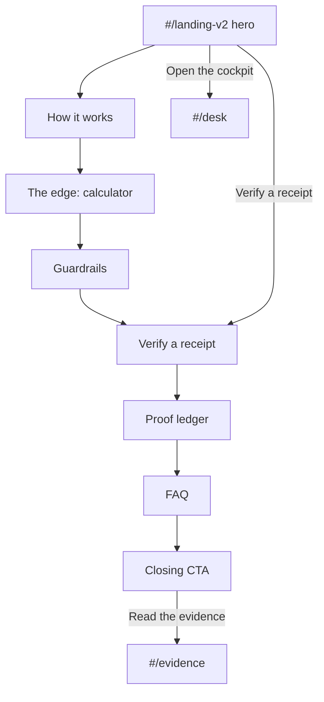

# Landing v2 — UX flow

## Use cases
1. **Evaluator** lands, grasps the idea in one screen, checks the guardrails, and decides whether to open the cockpit.
2. **Skeptic** goes straight to proof: verifies a receipt in-browser and reads which claims are only "Tested".
3. **Quant** plays with the basis calculator to see when an edge clears cost.

## Flow


## Wireframes (desktop)
```
[ links ]        [ ☾ MONEY BOYS ]        [ links | Open the cockpit ]
┌──────────────────────────────────────────────────────────────┐
│ (• US equities closed · next open Mon 09:30 ET)              │
│ The desk that trades          ┌─ Engine telemetry ──────┐    │
│ while Wall Street sleeps.     │ nodes · margin meter    │    │
│ [Open the cockpit][Verify]    │ (Hot path|Warm path)    │    │
└──────────────────────────────────────────────────────────────┘
 65% · $5,000 · <50 ms · 0 LLM-signed orders
 [01]  [02]  [03]  [04]   (stair-stepped)
 ── light ── edge copy | calculator card ──
 bento: [Risk veto (2)][Receipt] [LLM][Copilot (2)] [A/B (3)]
 ── light ── verifier ──   ledger   FAQ   closing CTA   footer
```
Mobile: single column; hero image sits in flow under the copy; nav collapses to a disclosure menu.

## Handoff notes
- Route lives in `src/App.tsx`; v1 and `#/desk`, `#/evidence` untouched.
- Data in: `DeskState` from App (no second fetch), `foundry/claims.jsonl?raw`.
- Test IDs: `basis-result`, plus Verifier's `verify-*`.
